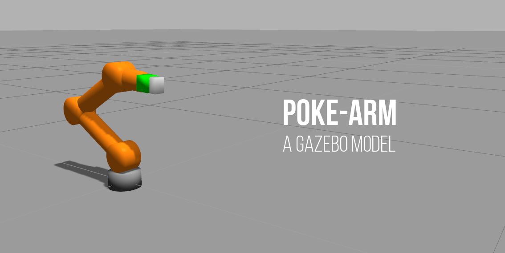
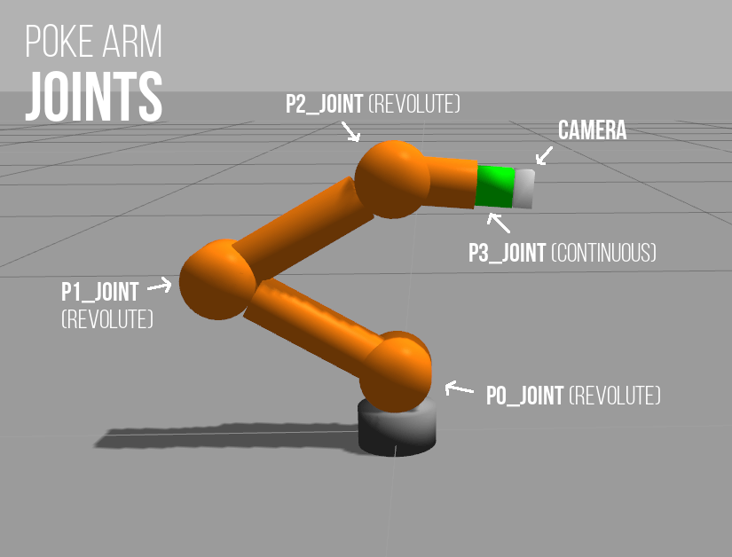
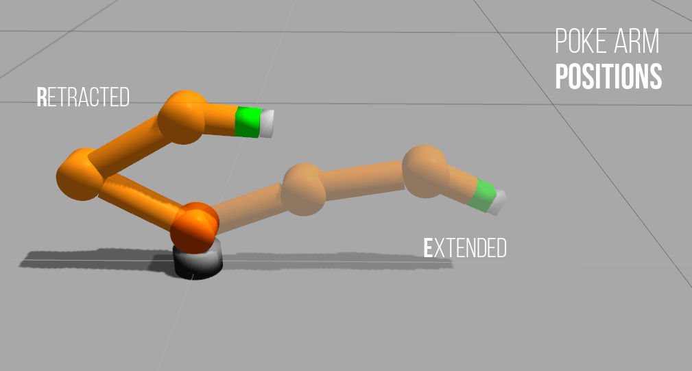
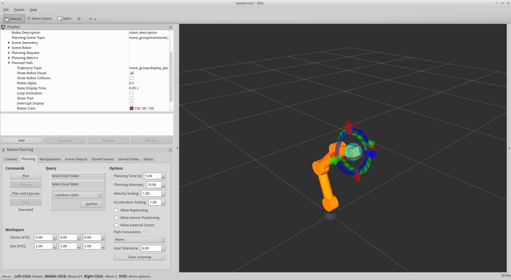
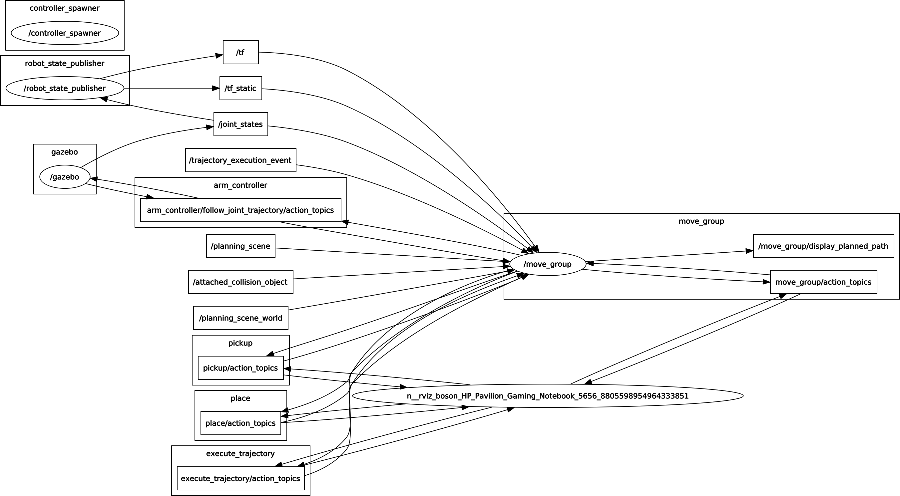

# poke-arm-gazebo

An experimental gazebo robotic arm model with 4 movable joints and a depth camera. Designed to be mounted on the Turtlebot gazebo model with only a forward extension capability.



> Currently, this package is only tested with Ubuntu 14.04 running Gazebo 2.2 & ROS Indigo.

## Installation
The *poke arm* model depends on the following packages:
- Gazebo ROS Packages
- ROS Controllers 
- MoveIt!
```bash
$ sudo apt-get install ros-indigo-gazebo-ros-*
$ sudo apt-get install ros-indigo-ros-controllers
$ sudo apt-get install ros-indigo-moveit
```
After that, git clone the repository to your workspace.
```bash
$ git clone https://github.com/1487quantum/poke-arm-gazebo.git
```

## Overview
### Joints
The poke arm is designed to push an object, therefore the *revolute* joints were configured to move in the x-axis direction.
- 1 *fixed* joint
- 3 *revolute* joints
- 1 *continuous* joint



### Camera
A RGBD (Depth) Camera is mounted at the end of the robot arm. :camera:
```
Camera Resolution: 320 X 240
Image Range: 0.01 - 18.0m
Field of View (FOV, Horizontal): 60°
```

## File structure
The folder are organised into 3 parts:
- poke_description: Contains the URDF description of the robot.
- poke_gazebo: Contains *launch* files to start gazebo & spawn the model in it.
- poke_control: Contains the controllers used to control the poke arm.

## Testing
### Via *rostopic*
To test the poke arm, roslaunch *poke_control.launch*. This will launch both the arm model and the controller in Gazebo.
```bash
$ roslaunch poke_control poke_control.launch
```


To retract the arm:
```bash
$ rostopic pub /arm_controller/command trajectory_msgs/JointTrajectory '{joint_names: ["p0_joint","p1_joint","p2_joint","p3_joint"], points: [{positions: [-1.2,2.5,0.6,0.0],time_from_start:[1.0,0.0]}]}' -1
```

To extend the arm:
```bash
$ rostopic pub /arm_controller/command trajectory_msgs/JointTrajectory '{joint_names: ["p0_joint","p1_joint","p2_joint","p3_joint"], points: [{positions: [1.2,0.2,0.6,0.0],time_from_start:[1.0,0.0]}]}' -1
```

### Via *Rviz*
To test the arm via Rviz, roslaunch *poke_moveit_control.launch*. This utilises the moveit_group to plan & execute the motion of the arm determined by the interactive marker of Rviz.
```
$ roslaunch poke_control poke_moveit_control.launch
```


The rqt_graph:




## Mounting *Poke arm* on Turtlebot
> It is better to download the relevant Turtlebot packages to your workspace than to install it via *apt-get*, as you have to modify the URDF/Xacro file.

> For this section, it is assumed that you are using the default turtlebot base configuration. (Kobuki, hexagon, asus_xtion_pro)

To mount the *Poke arm* on Turtlebot, you have to modify some files in the *turtlebot_description* directory/ROS Package. Open up the following xacro file. 
> turtlebot/turtlebot_description/robots/kobuki_hexagons_asus_xtion_pro.urdf.xacro

To add the arm, we'll add the *<poke_arm>* into the file. Therefore, the file should look like this:
```xml
<?xml version="1.0"?>
<!--
    - Base      : kobuki
    - Stacks    : hexagons
    - 3d Sensor : kinect
-->
<robot name="turtlebot" xmlns:xacro="http://ros.org/wiki/xacro">

  <xacro:include filename="$(find turtlebot_description)/urdf/turtlebot_common_library.urdf.xacro" />
  <xacro:include filename="$(find kobuki_description)/urdf/kobuki.urdf.xacro" />
  <xacro:include filename="$(find turtlebot_description)/urdf/stacks/hexagons.urdf.xacro"/>
  <xacro:include filename="$(find turtlebot_description)/urdf/sensors/asus_xtion_pro.urdf.xacro"/>

  <kobuki/>
  <stack_hexagons                 parent="base_link"/>
  <sensor_asus_xtion_pro          parent="base_link"/>

  <!-- Added the arm here -->
  <xacro:include filename="$(find poke_description)/urdf/poke.xacro" />
  <poke_arm parent="plate_top_link" color="white" joints_vlimit="1.571">
    <!-- Place the "floating" arm at the location it should be if mounted on a turtlebot -->
    <origin xyz="-0.05 0 0"/>
  </poke_arm>

</robot>
```

And viola! The arm is mounted!
